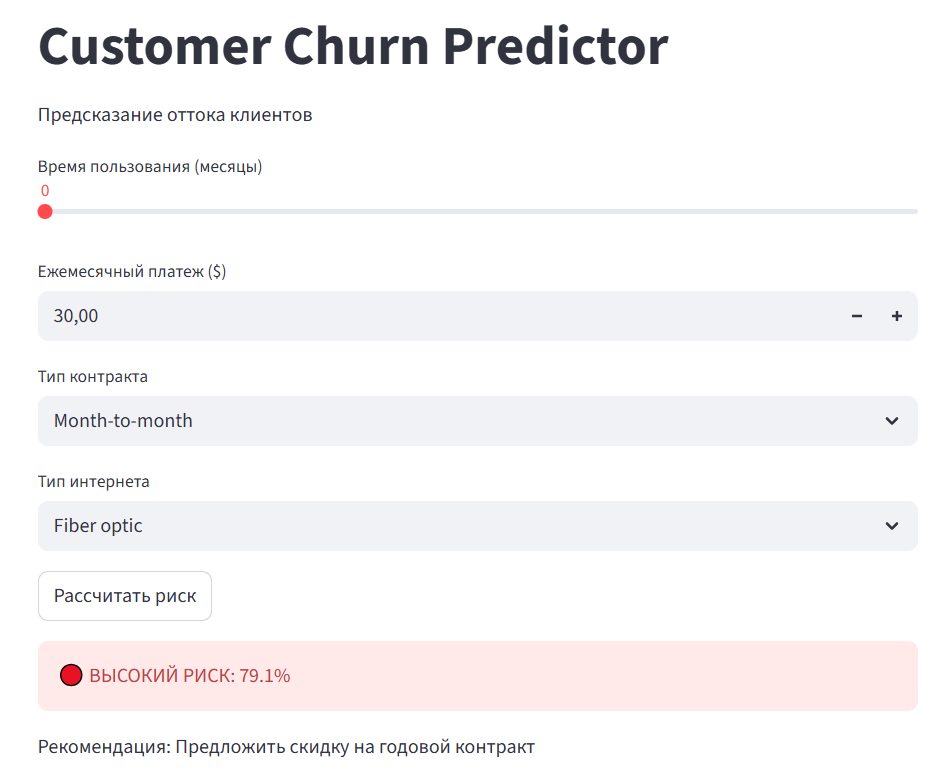

# Customer Churn Prediction & Risk Assessment

Проект для прогнозирования оттока клиентов и оценки финансовых рисков телеком-компании.

## О проекте

**Бизнес-проблема:** Высокий уровень оттока клиентов приводит к значительным финансовым потерям.

**Решение:** Разработана ML-модель для прогнозирования оттока и система оценки рисков с конкретными рекомендациями по удержанию клиентов.

### Ключевые результаты:
- **ML-модель** с ROC-AUC 0.84
- **Оценка рисков** с расчетом финансовых последствий
- **Сегментация** клиентов по уровню риска  
- **Web-приложение** для прогнозов в реальном времени
- **A/B тесты** и бизнес-рекомендации

## Структура проекта

```
customer-churn-analysis/
├── app/                    # Веб-приложение и модель
├── data/                   # Исходные данные
├── images_app/           # Скриншоты приложения
├── images_plots/               # Графики и визуализации
├── notebooks/             # Jupyter ноутбук с анализом
└── README.md              # Документация
```

## Технологический стек

- **Анализ данных:** Pandas, NumPy, SQL
- **Визуализация:** Matplotlib, Seaborn
- **Машинное обучение:** Scikit-learn
- **Веб-приложение:** Streamlit


## Методология анализа

### Этап 1: SQL и Exploratory Analysis
- Анализ демографии уходящих клиентов
- Анализ паттернов поведения
- Выявление топ-5 рискованных сегментов

### Этап 2: Machine Learning
- Предобработка
- Обучение Logistic Regression и Random Forest
- Оптимизация гиперпараметров

### Этап 3: Risk Assessment
- Расчет финансовых потерь от оттока: клиенты высокого риска приносят $1.5M/год
- Сегментация по риску: High/Medium/Low risk с эффективностью 66%/31%/7% реального оттока
- Приоритизация удержания: фокус на 1,567 клиентах высокого риска, особенно групп:
  - Month-to-month + Fiber optic: 1,390 клиентов ($112,456/месяц)
  - Month-to-month + DSL: 176 клиентов ($13,245/месяц)

### Этап 4: Business Insights
- Срочные меры удержания для 1,567 клиентов высокого риска
- A/B тест с предложением скидки 20% на переход на годовой контракт
- Персональные предложения для клиентов с комбинацией Fiber optic + Month-to-month

## Ключевые результаты

### ML Модель
- **Лучшая модель:** Logistic Regression
- **Accuracy:** 74%
- **ROC-AUC:** 0.84
- **Эффективность сегментации:**
  - High Risk: 66% реального оттока
  - Low Risk: 7% реального оттока

### Бизнес-Impact
- **Клиентов высокого риска:** 1,567 (22% базы)
- **Потенциальная сохраненная выручка:** $1.5M+/год
- **Основные риск-группы:** Month-to-month + Fiber optic

## Бизнес-рекомендации

### Приоритетные действия
1. Срочно предложить скидку 20% клиентам с Month-to-month контрактами
2. Улучшить качество Fiber optic для снижения жалоб
3. Внедрить систему оповещений о рисковых клиентах

### A/B тесты
- Тест 1: Скидка 20% на переход на годовой контракт
- Тест 2: Бесплатные месяцы vs постоянная скидка

### Сегментные стратегии
- Month-to-month + Fiber optic: переход на годовой контракт со скидкой
- Пенсионеры без семьи: специальные тарифы + упрощенная поддержка

## Веб-приложение



**Возможности:**
- Ввод данных клиента через веб-интерфейс
- Мгновенный расчет вероятности оттока
- Рекомендации по удержанию для каждого уровня риска

## Быстрый старт

### 1. Клонирование репозитория
```bash
git clone https://github.com/your-username/customer-churn-analysis
cd customer-churn-analysis
```

### 2. Установка зависимостей
```bash
pip install -r requirements.txt
```

### 3. Запуск веб-приложения
```bash
streamlit run app/app_churn.py
```

## Данные

Использован датасет [Telco Customer Churn](https://www.kaggle.com/datasets/blastchar/telco-customer-churn) с Kaggle:
- 7,043 клиента
- 21 признак (демография, услуги, платежи)
- 26.5% уровень оттока

## Автор

Ниязова Камилла - Начинающий аналитик данных
- GitHub: [wlbrnd](https://github.com/wlbrnd)

